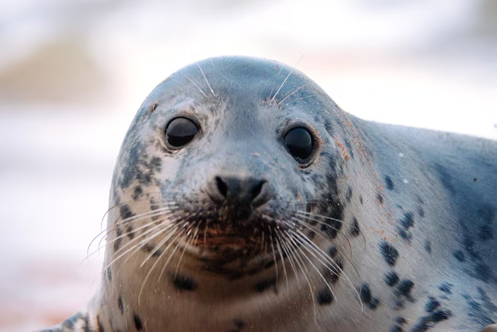

# **Тюлени** 

_Описание:_
* Тело обтекаемое и удлинённое, адаптированное к жизни в воде.
* Вес особей варьируется в широком диапазоне — от 150 кг до 2,5 тонн, длина тела — от 1,5 до 6,5 метров.
* На суше тюлени кажутся неуклюжими: массивное тело, покрытое короткой шерстью, толстая шея, небольшая голова и ласты.
* В воде они преображаются в грациозных пловцов.

